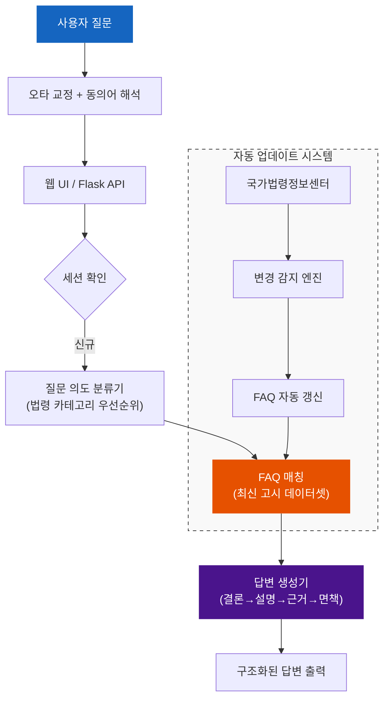

# 보세전시장 민원응대 챗봇

법제처 국가법령정보센터의 현행 법령과 관세청 공식 자료를 기반으로 한 보세전시장 민원응대 챗봇 시스템입니다.

---

## 🚀 최신 업데이트 안내
- **최신 고시 반영**: 「보세전시장 운영에 관한 고시(관세청고시 제2026-15호, 2026. 3. 24. 시행)」 완벽 반영
- **신설 조문 추가**: 제22조의2(요건면제 물품의 처리) 등 최신 개정 사항 데이터화 완료
- **자동화 스케줄링**: 매일 자정 국가법령정보센터 모니터링 및 데이터 자동 갱신 기능 활성화

---

## 주요 수치

| 항목 | 수치 |
|------|------|
| FAQ | 60개 (v4.2.0 Premium) |
| 질문 카테고리 | 10개 |
| 법령 근거 | 관세법, 시행령, 고시(2026-15호) 등 |
| 테스트 | 2,100개 이상 (전체 PASS) |
| 업데이트 주기 | 매일 자동 갱신 (Cron 설정 완료) |

---

## 핵심 기능

| 기능 | 설명 |
|------|------|
| **법령 기반 매칭** | 관세법 및 최신 고시 조항을 직접 인용하여 답변의 신뢰도 확보 |
| **하이브리드 매칭** | 키워드 스코어 → TF-IDF → BM25 폴백 3단계 매칭으로 정확도 극대화 |
| **최신성 유지** | 국가법령정보센터 실시간 모니터링을 통한 데이터 자동 업데이트 |
| **전문 페르소나** | 법적 근거와 면책 공고를 포함한 전문가 스타일의 답변 생성 |
| **일상 대화 대응** | 기본적인 인사말 및 챗봇 안내 등 Small Talk 기능 강화 |

---

## 시스템 아키텍처



---

## 빠른 시작

### 설치
```bash
git clone https://github.com/sun475300-sudo/bonded-exhibition-chatbot-data.git
cd bonded-exhibition-chatbot-data
pip install -r requirements.txt
```

### 시뮬레이터 실행
```bash
# 특정 질문 테스트
python3 simulator.py -q "요건면제 물품은 어떻게 처리하나요?"

# 대화형 모드
python3 simulator.py
```

---

## 📂 프로젝트 구조

```
bonded-exhibition-chatbot-data/
├── config/
│   ├── system_prompt.txt          # 법령 중심 시스템 프롬프트
│   └── chatbot_config.json        # 챗봇 페르소나 및 카테고리 설정
├── data/
│   ├── faq.json                   # 최신 법령 반영 FAQ (v4.2.0)
│   ├── legal_references.json      # 법령 근거 데이터
│   └── escalation_rules.json      # 에스컬레이션 규칙
├── src/
│   ├── chatbot.py                 # 유연한 매칭 로직 (Threshold 조정 완료)
│   ├── similarity.py              # TF-IDF 유사도 엔진
│   └── scheduler.py               # 매일 자동 업데이트 스크립트
└── simulator.py                   # 답변 품질 검증 시뮬레이터
```

---

## ⚖️ 법적 고지
본 챗봇의 답변은 일반적인 안내용 설명이며, 구체적인 사실관계에 따라 결론이 달라질 수 있습니다. 최종적인 법적 판단이나 처리는 반드시 관할 세관 또는 관세청 담당 부서를 통해 확인하시기 바랍니다.
